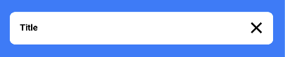
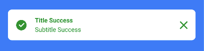
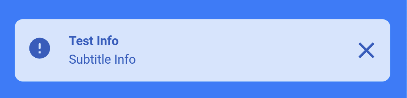
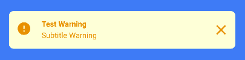
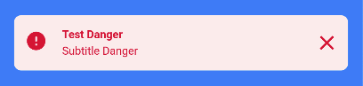
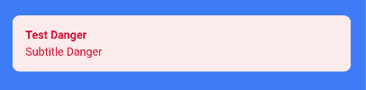

# GistPopUp
GistPopUp is Flutter pop-up library with Gits UI Style. This library inspired from [Bot Toast](https://pub.dev/packages/gits_http).

## Features
- [x] Notification bar
- [ ] Loading
- [ ] Text toast
## Usage
### Setup
Initialize the library on your <code>MaterialApp</code>

```dart
return MaterialApp(
    title: 'Your application',
    theme: ThemeData(),
    home: const HomePage(),
    builder: (context, child) {
    return gitsPopUpInit(context, child);
    },
    navigatorObservers: [GitsPopUpNavigatorObserver()],
);
```
### Custom Settings
You can override the default setting with <code>GitsPopUpSettings</code>
```dart
return MaterialApp(
    title: 'Your application',
    theme: ThemeData(),
    home: const HomePage(),
    builder: (context, child) {
        GitsPopUpSettings(
            blackColor: const Color(0xFF000000),
            whiteColor: const Color(0xFFFFFFFF),
            successColor: const Color(0xFFFFFFFF),
            successBackgroundColor: const Color(0xFFFFFFFF));
        return gitsPopUpInit(context, child);
    },
    navigatorObservers: [GitsPopUpNavigatorObserver()],
);
```
### Notification Bar
Default notification :
<p align="center">
  
</p>

```dart
GitsPopUp.showNotif(
    title: "Title",
);
```
Success notification :
<p align="center">
  
</p>

```dart
GitsPopUp.showSuccessNotif(
    title: "Title Success",
    subtitle: "Subtitle Success", // Optional
);
```
Info notification :
<p align="center">
  
</p>

```dart
GitsPopUp.showInfoNotif(
    title: "Title Info",
    subtitle: "Subtitle Info", // Optional
);
```
Warning notification :
<p align="center">
  
</p>

```dart
GitsPopUp.showWarningNotif(
    title: "Title Warning",
    subtitle: "Subtitle Warning", // Optional
);
```
Danger notification :
<p align="center">
  
</p>

```dart
GitsPopUp.showDangerNotif(
    title: "Title Danger",
    subtitle: "Subtitle Danger", // Optional
);
```

Hide leading and trailing widget :
<p align="center">
  
</p>

```dart
GitsPopUp.showDangerNotif(
    title: "Test Danger",
    subtitle: "Subtitle Danger",
    showLeading: false,
    showTrailing: false)
);
```
Custom notification :
```dart
GitsPopUp.showCustomNotif(
    gitsPopUpBuilder: (cancelFunction) => YourCustomWidget(),
);
```
## General Attributes
| Attribute | Type  | Default | Required | Description |
|-----------|-------|---------|-------------|----------|
| `crossPage` | `bool` | `true` | `No` | The pop up bar by default is shown on the whole page, when set to false, it will automatically close when you navigate to another page
| `onlyOne` | `bool` | `true` | `No` | by default only one pop up appears, if you want to stack the pop up then change it to false
